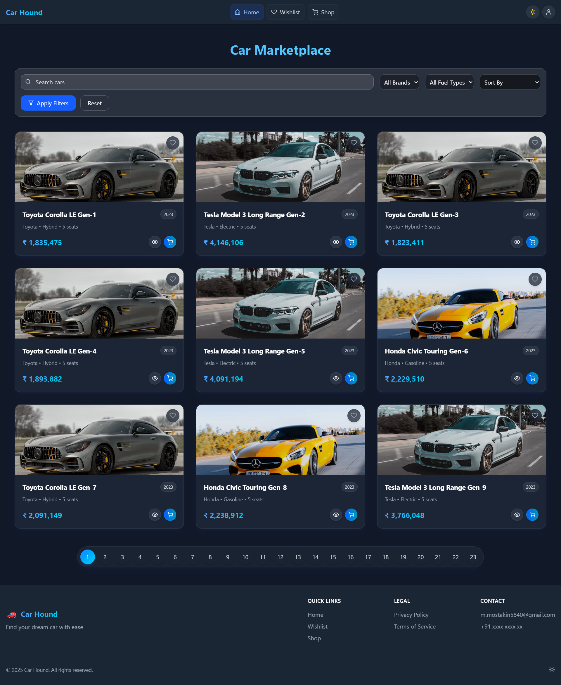
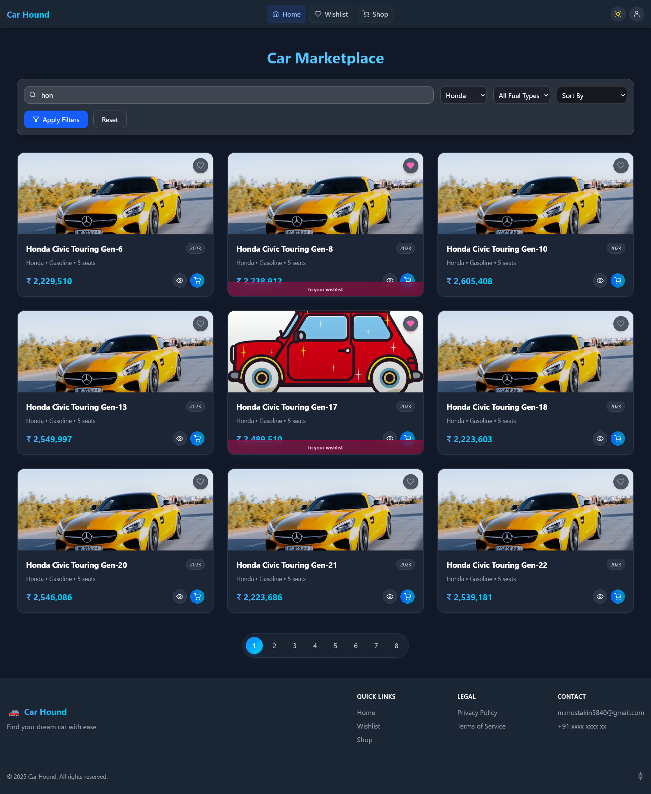
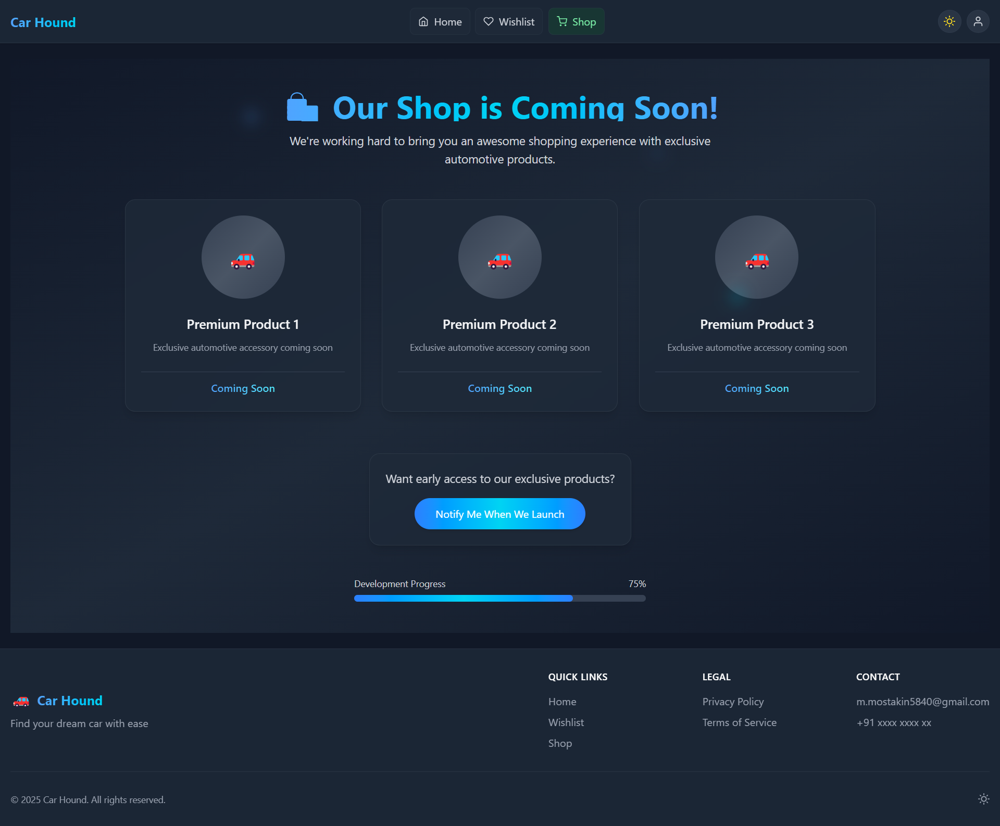
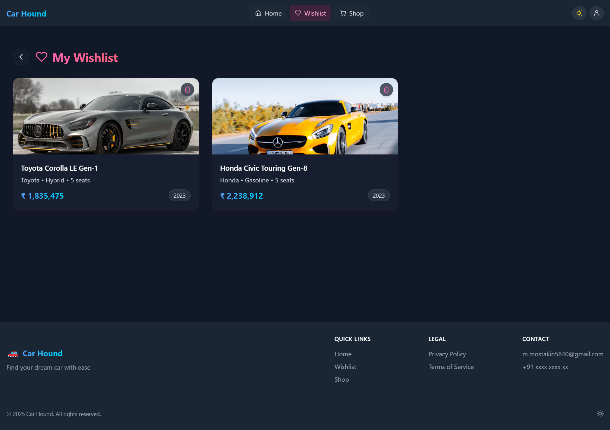
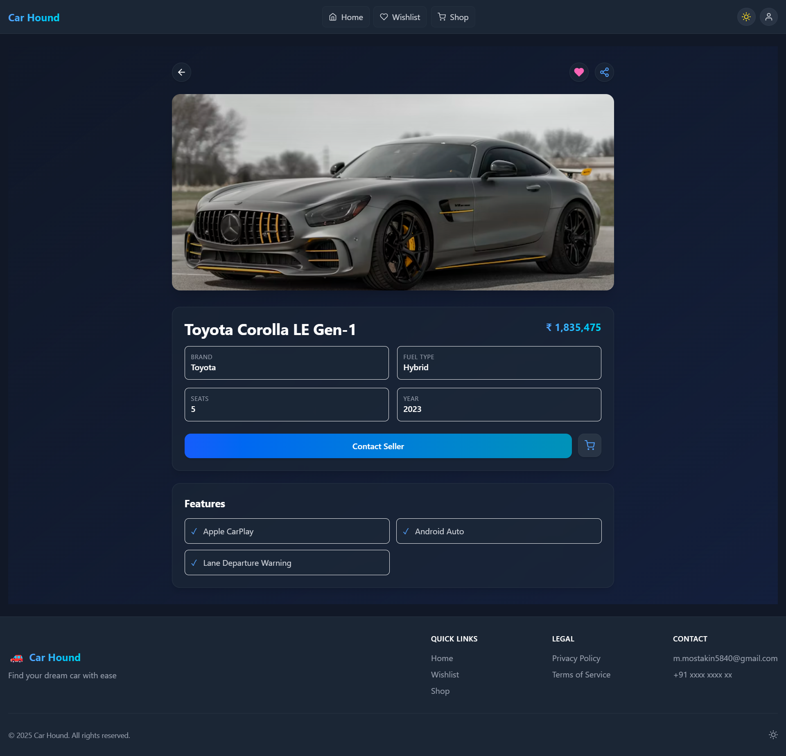

# 🚗 Car Finder Web App : [Car Hound](https://car-hound.netlify.app/)

A responsive and feature-rich Car Finder Web Application built with **React.js** and **Tailwind CSS**. It allows users to filter and browse cars based on brand, fuel type, price range, and seating capacity, view detailed specifications, and manage a wishlist — all with seamless interactions.

---

## ✨ Features

- 🔍 **Search & Filters**: Filter cars by brand, fuel type, price range, and seating capacity.
- 📄 **Car Details View**: Click any car to view detailed information.
- 💖 **Wishlist**: Add/remove cars to wishlist — stored in browser LocalStorage.
- ⚙️ **Real-Time UI Updates**: Live update on filtering, searching, and wishlist changes.
- 🌗 **Dark Mode Toggle**: Easily switch between light and dark themes.
- 🚀 **Pagination**: Only 10 cars shown per page for better performance.
- 💅 **Responsive UI**: Built with Tailwind CSS and optimized for all screen sizes.
- 🌀 **Smooth Animations**: Framer Motion used for modern transitions.

---

## 🛠️ Tech Stack

- **Frontend:** React.js
- **Styling:** Tailwind CSS
- **Animations:** Framer Motion
- **Icons:** React Icons
- **State Management:** useState, useEffect
- **Data Storage:** LocalStorage (for wishlist)
- **Routing:** React Router DOM

---

## 📦 Installation & Setup

1. **Clone the Repository**
   ```bash
   git clone https://github.com/mostakin5290/Car-Hound.git
   cd car-finder-app
   ```

2. **Install Dependencies**
   ```bash
   npm install
   ```

3. **Start the Development Server**
   ```bash
   npm run dev
   ```

4. **Visit the App**
   ```bash
   http://localhost:5173
   ```

---

## 🧪 API Setup (Mock or Real)

This project uses a mock API (or static JSON data). You can:

- Use JSON Server or a public car API
- Or create your own backend using Express

Make sure your data structure includes:

- `id`, `brand`, `price`, `fuelType`, `seatingCapacity`, `image`, `description`

---

## 📷 Screenshots

| Home Page | Filtered Results | Shop Page | Wishlist | Car Details |
|-----------|------------------|-------------|----------|----------|

|  |  |  |  |  |
---

## 📌 Live Demo

🔗 [Live Site](https://car-hound.netlify.app/)

---

## 🧑‍💻 Author

- **Mostakin Mondal**
- GitHub: [@mostakin5290](https://github.com/mostakin5290)
- Email: m.mostakin5840@gmail.com

---
#### ***Thank You***
